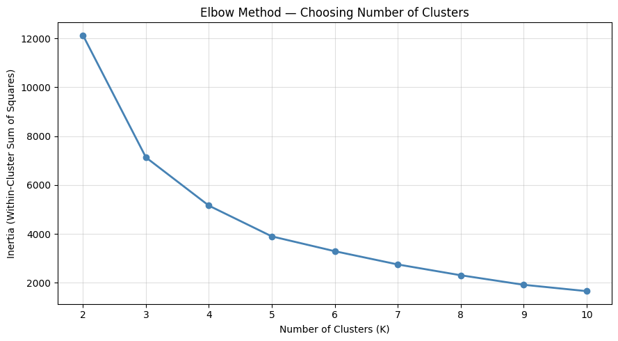

# Retail Sales & Customer Segmentation Analysis

> **A full-stack data analytics project on 1M+ real retail transactions — combining SQL, Python, machine learning, and business storytelling.**

**Dataset:** [Online Retail II — UCI ML Repository](https://archive.ics.uci.edu/dataset/502/online+retail+ii) | 1,067,371 raw rows → 779,425 after cleaning (73% retained) | Dec 2009 – Dec 2011

---

## What This Project Found

---

### 📈 1. Revenue is Seasonal — Peak in October, Crash in December

Analysis of 25 months of transactions reveals a consistent pattern every year: **October and November consistently break £1M in revenue**, then December drops sharply. Customers place their holiday orders in October — not December.

| Month | 2010 Revenue | 2011 Revenue |
|---|---|---|
| October | £1,033,112 | £1,035,642 |
| November | £1,166,460 | £1,156,205 |
| December | £570,422 | £517,208 |

**Recommendation:** Begin inventory build-up in September. Launch early-access promotions in October to capture peak demand before competitors.

---

### 👥 2. Four Customer Segments Identified via RFM + KMeans Clustering

Each customer was scored on **Recency** (days since last purchase), **Frequency** (number of orders), and **Monetary** (total spend). KMeans clustering grouped 5,938 customers into 4 distinct segments.

| Segment | Customers | Avg Spend | Avg Recency | What They Are |
|---|---|---|---|---|
| 🟡 **VIP Wholesale** | 4 | £422,092 | 3.5 days | Mega buyers — your entire top-line depends on 4 clients |
| 🟢 **Champions** | 42 | £67,850 | 20 days | Frequent, high-value, recent — your best regular customers |
| 🔵 **Loyal** | 3,859 | £2,811 | 66 days | Core customer base — biggest group, moderate spend |
| 🔴 **Lost** | 2,037 | £619 | 466 days | Haven't bought in 15+ months — not worth re-engaging |

> **Key finding:** This is a **B2B wholesale company**, not a consumer retailer. Average order values of £422K confirm bulk buying — individual consumers don't spend that way.

**Clusters chosen using the Elbow Method:**

---

### 🏆 3. Top 10 Customers Drive a Disproportionate Share of Revenue

The top 5 customers alone account for over £1.9M in lifetime value. Customer 18102 spent £580,987 across 145 orders.

| Rank | Customer ID | Country | Lifetime Value | Orders |
|---|---|---|---|---|
| 1 | 18102 | United Kingdom | £580,987 | 145 |
| 2 | 14646 | Netherlands | £528,602 | 151 |
| 3 | 14156 | Ireland | £313,437 | 156 |
| 4 | 14911 | Ireland | £291,420 | 398 |
| 5 | 17450 | United Kingdom | £244,784 | 51 |

**Recommendation:** Assign dedicated account managers to all VIP Wholesale and Champion customers. The cost of losing one client far exceeds the cost of a full retention programme.

---

### 🤖 4. Churn Prediction Model — AUC-ROC: 0.84

A **Logistic Regression** classifier trained on a time-split approach (training: Dec 2009–Jun 2011, performance window: Jul–Dec 2011) predicts which Loyal customers will stop buying before they actually do.

- **75% accuracy** on held-out test data
- **77% recall** on churners — catches 386 of 501 actual churners
- Logistic Regression outperformed Random Forest (0.84 vs 0.81 AUC) — simpler model won because the relationship between features and churn is largely linear

#### What Predicts Churn Most?

**Recency is the #1 churn signal** — more important than how often or how much a customer spends. If they haven't bought recently, the clock is ticking.

#### Churn Risk Breakdown — 1,998 Loyal Customers Scored

| Risk Level | Customers | Recommended Action |
|---|---|---|
| 🔴 High Risk | 1,053 | Likely already gone — low ROI to pursue |
| 🟡 Medium Risk | **883** | **Primary target — still saveable** |
| 🟢 Low Risk | 62 | Healthy — maintain relationship |

**Recommendation:** Focus re-engagement budget exclusively on the 883 Medium Risk customers. A personalised "we miss you" email at the 60-day inactivity mark costs almost nothing — but losing a £2,800 average-spend customer does.

---

## 3 Actions a Business Can Take Today

| # | Action | Segment | Expected Impact |
|---|---|---|---|
| 1 | Protect top 46 customers with dedicated account management | Champions + VIP | Retain £500K+ annual revenue |
| 2 | Re-engagement campaign on 883 Medium Risk Loyal customers | Loyal (Medium Risk) | Recover customers before they go Lost |
| 3 | Front-load marketing spend to September–October every year | All segments | Capture £1M+ seasonal peak before competitors |
